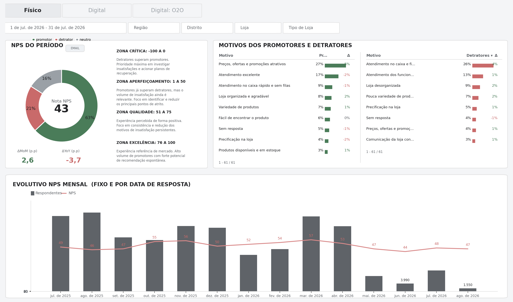
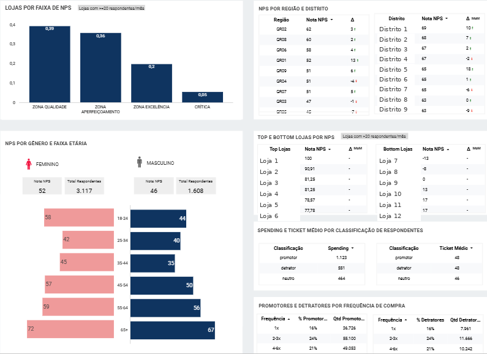

# Physical-Store NPS Pipeline & Dashboard (BigQuery + Looker Studio)

End-to-end NPS (Net Promoter Score) analytics pipeline built for a large multi-channel retailer, covering the **physical-store** journey: raw survey ingestion → reason-code standardization → customer/store enrichment → aggregated metrics → an interactive Looker Studio dashboard used by regional and store-level stakeholders.

> **Note on anonymization:** this repo is a sanitized version of a production pipeline. All project IDs, dataset names, table names, and column names that referenced the original company were renamed to generic equivalents (e.g. `analytics-portfolio.*`). Store names and district names in the dashboard screenshots were replaced with generic placeholders (`Loja 1`, `Distrito 1`, ...). The SQL logic, joins, edge-case handling, and business rules are unchanged from what runs in production.

## What this pipeline does

1. **Deduplicates and cleans raw survey responses** from a `resp_solucx`-style source table, filtering out non-store journeys (delivery, market research placeholders, etc.) and keeping the latest response per order/reason.
2. **Standardizes free-text reason codes** via a `DE-PARA` (old → new) mapping table, matched through a 3-step cascade (exact match → punctuation-stripped match → already-normalized match), falling back to the raw text when nothing matches. Output is always forced to sentence case.
3. **Handles a mid-year taxonomy/date-logic migration**: responses before a cutover date use the *response date*; responses after it use the *order date* instead, with a cutoff of "day 7 of the following month" to decide which orders are still eligible.
4. **Extracts store IDs from inconsistent free-text fields** (`"101"`, `"L527 - STORE NAME"`, `"L135+-+STORE+NAME"`) using regex, including handling of `+`-encoded spaces from URL-style exports.
5. **Enriches responses** with store dimension (region/district/type), customer profile (age band, gender), and trailing-12-month transaction behavior (average ticket, spending).
6. **Computes NPS and NPS bands** (Critical / Quality / Excellence) per store/region/month, plus a spine join against a full date × age-band grid so every combination exists even with zero responses.
7. **Builds an auxiliary table** with purchase-frequency distribution (1x, 2-3x, 4-6x, 7x+) segmented by NPS classification, to analyze the relationship between loyalty behavior and satisfaction.

The resulting tables feed a Looker Studio dashboard (screenshots below) used to monitor NPS trends, top/bottom-performing stores, promoter/detractor reasons, and demographic breakdowns across regions and districts.

## Debugging & data-quality work behind this pipeline

A meaningful part of this project was diagnosing and fixing real data-quality issues, for example:
- A dashboard widget silently returning "no data" for the two most recent months — traced to a journey filter that excluded a renamed taxonomy value, not a join or permissions issue.
- A discrepancy between a summary KPI and a trend chart pulling from the *same* source table — root-caused to two different date fields being used as the x-axis (order date vs. a hybrid response/order date), which silently dropped responses without a matched transaction.
- A store-ID field with three overlapping data-quality problems at once (non-numeric placeholder values, a composite `"code - store name"` format, and duplicate encodings of the same store with `+` vs. space) — resolved with a single regex extraction plus an explicit exclusion list.
- A parallel, independently-calculated variance table that never matched the main pipeline because it used different dedup keys and filters — consolidated into a single source of truth computed with `LAG()` over the main aggregated table.

## Dashboard preview

**Physical NPS overview** — period NPS, monthly trend, and top promoter/detractor reasons:

**Store, region and demographic breakdown** — NPS by store tier, region/district, gender/age, and purchase frequency:

## Stack

- **BigQuery** (standard SQL, temp functions, window functions, regex extraction)
- **Looker Studio** for the front-end dashboard
- Source-of-truth tables: survey responses, store dimension, customer profile, and transactions, joined and aggregated into a single denormalized reporting table

## Files

| File | Description |
|---|---|
| `nps_pipeline_consolidated.sql` | Full pipeline: raw response cleaning, reason-code mapping, enrichment, NPS/band calculation, and the auxiliary purchase-frequency table |
| `img1_dashboard_fisico.png` | Dashboard screenshot — NPS overview, monthly trend, promoter/detractor reasons |
| `img2_anonymized.png` | Dashboard screenshot — store/region/demographic breakdown (store and district names anonymized) |

---

*Part of a broader analytics-engineering portfolio focused on BigQuery pipeline design, data-quality debugging, and CDP/loyalty data integration.*
